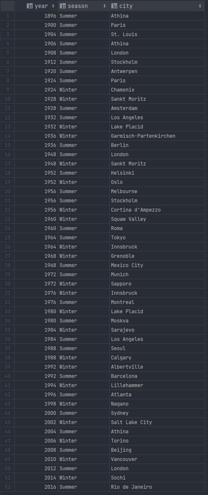

# Olympic History Data Analysis

## Overview
This project involves a detailed analysis of a historical dataset on the modern Olympic Games, spanning from Athens 1896 to Rio 2016. The analysis delves into various aspects of the dataset, focusing on distinct analytical tasks.

## Dataset
The dataset is sourced from [Kaggle](https://www.kaggle.com/datasets/heesoo37/120-years-of-olympic-history-athletes-and-results) and was originally compiled by www.sports-reference.com. It includes over 271,000 rows, detailing individual athletes' participation in the Olympic Games.

## Analysis Tasks

### Task 1: Number of Olympic Games Held

#### Analysis
This task aimed to determine the total number of Olympic Games held within the covered period. The findings indicate that 51 Olympic Games were conducted.

### Task 2: Enumeration of All Olympic Games

#### Analysis
This task provided an exhaustive list of Olympic Games, specifying their years and host locations.

### Task 3: Participation Trends by Nation

#### Analysis
This analysis examined the variation in the number of participating countries over the years. The year 2016 marked the peak in participation.

### Task 4: Extremes in National Participation

#### Analysis
This task identified the years with the highest and lowest national participation. The year 1896 saw the least, while 2016 experienced the highest participation.

### Task 5: Seasonal Distribution of Games

#### Analysis
The analysis aimed to discern the seasonal distribution of Olympic Games. Summer seasons were found to be the more prevalent choice for the Olympics.

### Task 6: Diversity of Sports in Each Game

#### Analysis
The task explored the range of sports featured in each Olympic Games. The summer Olympics exhibited a greater variety of sports.

### Task 7: Top Gold Medalists

#### Analysis
This task aimed to pinpoint the top 5 gold medal-winning athletes, revealing 18 athletes sharing the top positions.

### Task 8: Medal Tally by Country

#### Analysis
The analysis focused on the total medals won by each country, with the USA leading in the overall medal count.

### Task 9: Dominant Countries in Each Game

#### Analysis
This task examined the countries that won the most medals in each Olympic game across different medal types.

## Conclusion
The Olympic History Data Analysis project provides a comprehensive exploration of over a century of Olympic events, revealing significant trends in athlete participation, country performance, and the evolution of sports. Key findings include the USA's dominance in medal acquisition and the increasing diversity of participating nations, highlighting the growing global reach of the Olympics. These insights offer a unique perspective on the development and significance of this international sporting event.

## How to Run the SQL Scripts
1. Set up an SQL environment such as MySQL, PostgreSQL, or SQLite.
2. Import the Olympic dataset into your SQL environment.
3. Execute the queries as per the numbered tasks in the script.